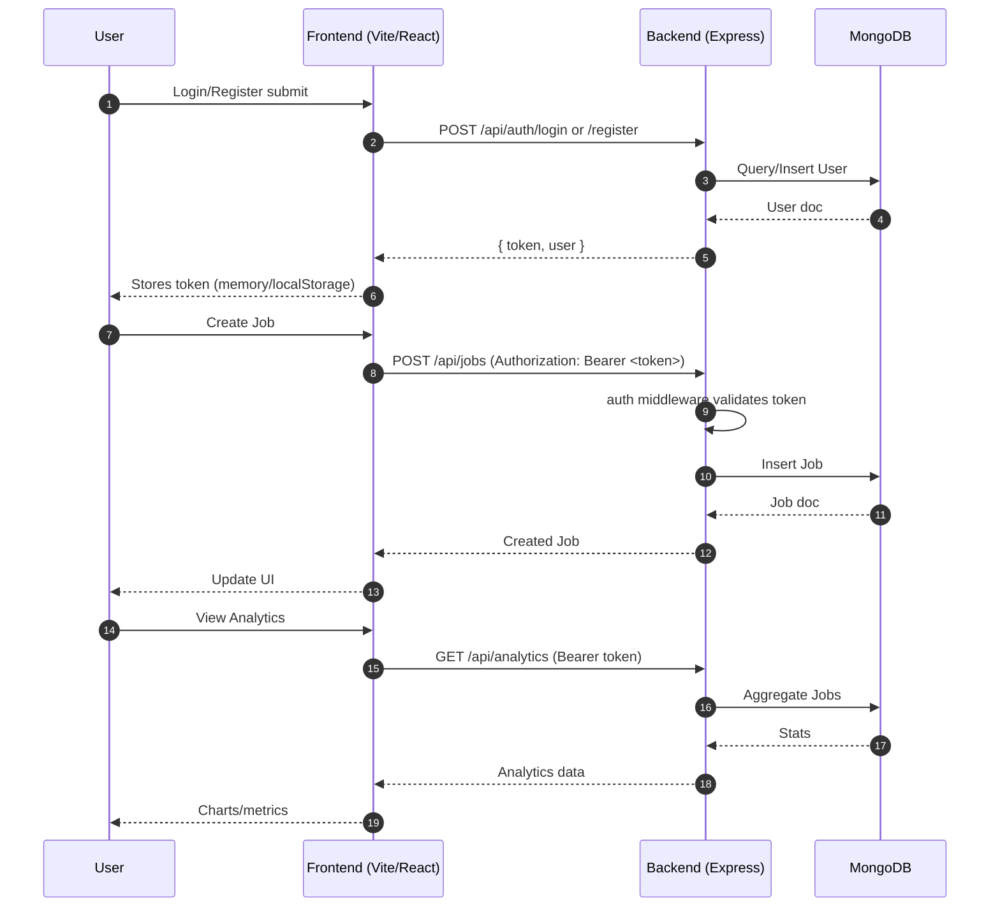
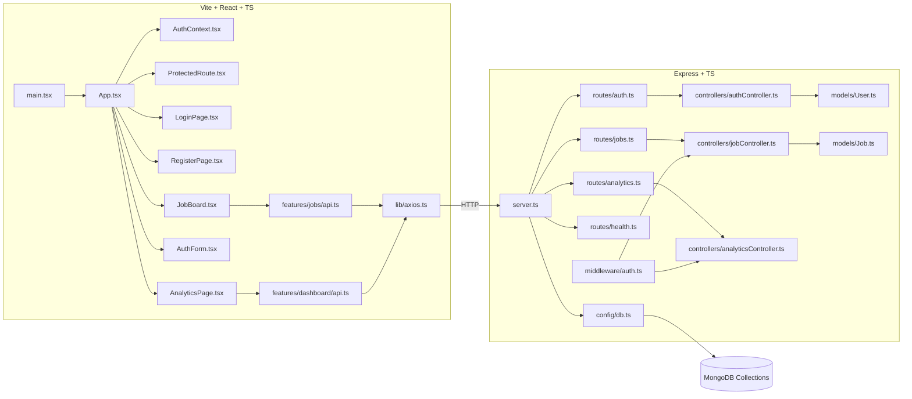

## Job Tracker – Monorepo (Backend + Frontend)

A full‑stack Job Tracking application with a Node.js/Express + TypeScript backend and a Vite + React + TypeScript frontend. Includes authentication, job CRUD, and analytics.

### Contents
- Setup and prerequisites
- Environment variables
- Scripts (dev/build/test)
- Project structure
- How things connect (file map)
- Request workflow (end‑to‑end)
- Architecture diagrams (Mermaid)
- API overview
- Data models
- Development tips

---

### Prerequisites
- Node.js 18+ and npm
- MongoDB (local or cloud e.g., Atlas)

---

### Setup
1) Install dependencies
```bash
# from repo root
cd backend && npm install
cd ../frontend && npm install
```

2) Configure environment variables
- Copy `.env.example` (if present) or create `.env` files using the variables below.

3) Seed demo data (optional)
```bash
cd backend
npm run seed
```

4) Run in development
```bash
# in two terminals or using separate tabs
cd backend && npm run dev
cd frontend && npm run dev
```

- Backend default: `http://localhost:5000`
- Frontend default: `http://localhost:5173`

---

### Environment variables
Create `backend/.env`:
```
PORT=5000
MONGODB_URI=mongodb://localhost:27017/job-tracker
JWT_SECRET=replace-with-strong-secret
JWT_EXPIRES_IN=7d
CORS_ORIGIN=http://localhost:5173
```

Create `frontend/.env` (Vite uses VITE_ prefix):
```
VITE_API_BASE_URL=http://localhost:5000/api
```

---

### Scripts
Backend (`backend/package.json`):
- `npm run dev`: start with ts-node-dev / nodemon
- `npm run build`: compile TypeScript
- `npm start`: run compiled server
- `npm run seed`: seed database (`src/scripts/seed.ts`)

Frontend (`frontend/package.json`):
- `npm run dev`: start Vite dev server
- `npm run build`: production build
- `npm run preview`: preview prod build

---

### Project structure (key files)
```
backend/
  src/
    server.ts
    config/db.ts
    middleware/auth.ts
    utils/jwt.ts
    models/
      User.ts
      Job.ts
    controllers/
      authController.ts
      jobController.ts
      analyticsController.ts
    routes/
      auth.ts
      jobs.ts
      analytics.ts
      health.ts
    scripts/seed.ts
    types/express/index.d.ts
frontend/
  src/
    app/ProtectedRoute.tsx
    features/
      auth/
        AuthContext.tsx
        AuthForm.tsx
        LoginPage.tsx
        RegisterPage.tsx
      jobs/
        api.ts
        JobBoard.tsx
        JobCard.tsx
        JobForm.tsx
      dashboard/
        api.ts
        AnalyticsPage.tsx
        DashboardLayout.tsx
        Navbar.tsx
    lib/
      axios.ts
      utils.ts
    App.tsx
    main.tsx
```

---

### How things connect (file map)
- Backend entry
  - `src/server.ts`
    - loads `config/db.ts` (Mongo connection)
    - mounts Express routers: `routes/auth.ts`, `routes/jobs.ts`, `routes/analytics.ts`, `routes/health.ts`
  - Routers → Controllers
    - `routes/auth.ts` → `controllers/authController.ts`
    - `routes/jobs.ts` → `controllers/jobController.ts`
    - `routes/analytics.ts` → `controllers/analyticsController.ts`
  - Controllers → Models/Utils
    - Use `models/User.ts`, `models/Job.ts`
    - Use `middleware/auth.ts` for protected routes
    - Use `utils/jwt.ts` for token sign/verify

- Frontend entry
  - `src/main.tsx` → mounts `App.tsx`
  - `App.tsx` → routes to pages; wraps with `AuthContext.tsx`
  - Auth flow
    - `AuthForm.tsx`, `LoginPage.tsx`, `RegisterPage.tsx` → call `lib/axios.ts` to backend `auth` routes
  - Protected areas
    - `ProtectedRoute.tsx` uses context from `AuthContext.tsx`
  - Jobs features
    - UI: `JobBoard.tsx`, `JobCard.tsx`, `JobForm.tsx`
    - Data: `features/jobs/api.ts` → `lib/axios.ts` → backend `jobs` routes
  - Analytics features
    - UI: `AnalyticsPage.tsx`, `DashboardLayout.tsx`, `Navbar.tsx`
    - Data: `features/dashboard/api.ts` → `lib/axios.ts` → backend `analytics` routes

---

### End‑to‑end request workflow


---

### Architecture overview


---

### API overview (high‑level)
Base URL: `http://localhost:5000/api`

- Auth
  - `POST /auth/register` → create account
  - `POST /auth/login` → returns JWT
- Jobs (Protected)
  - `GET /jobs` → list jobs
  - `POST /jobs` → create job
  - `PUT /jobs/:id` → update job
  - `DELETE /jobs/:id` → delete job
- Analytics (Protected)
  - `GET /analytics` → summary statistics
- Health
  - `GET /health` → simple status

JWT is sent as `Authorization: Bearer <token>`.

---

### Data models (simplified)
- `models/User.ts`
  - Fields: email, passwordHash, name, createdAt
- `models/Job.ts`
  - Fields: title, company, status, type, location, createdBy (User ref), createdAt, updatedAt

---

### Development tips
- Frontend API base is configured in `frontend/src/lib/axios.ts` and `.env` (`VITE_API_BASE_URL`).
- Ensure backend CORS allows the frontend origin (`CORS_ORIGIN`).
- Keep JWT securely; for production, prefer HTTP‑only cookies.
- Use `src/types/express/index.d.ts` to extend Express `Request` types if needed.
- Seed script is useful to quickly demo the board and analytics.

---

### Contributing
- Use feature branches; open PRs with clear descriptions and screenshots/recordings for UI changes.
- Run formatters/linters if configured, and ensure no TypeScript errors.

---
### License
MIT (or your chosen license)
